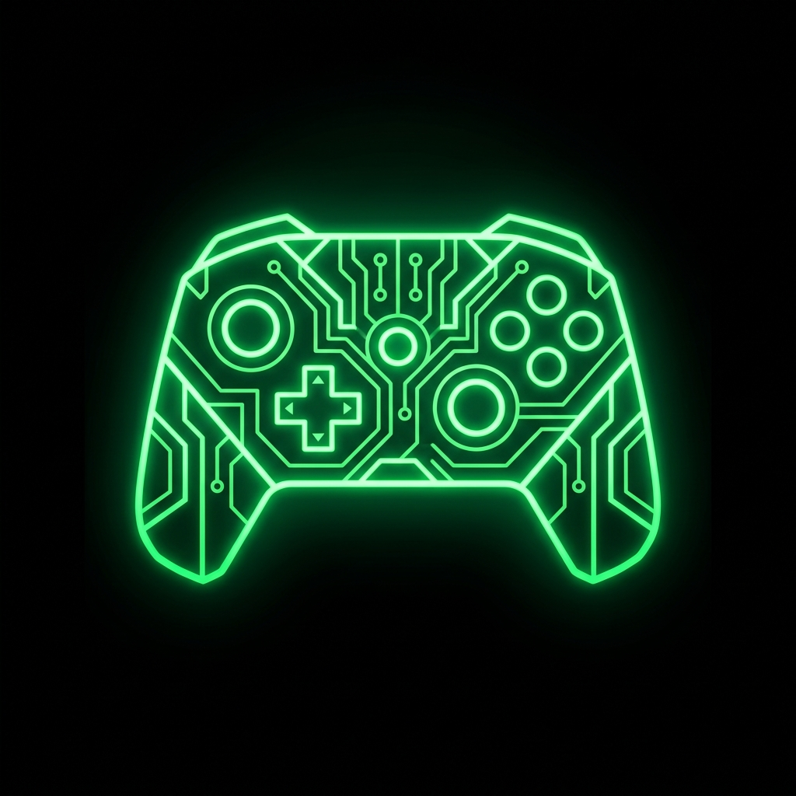
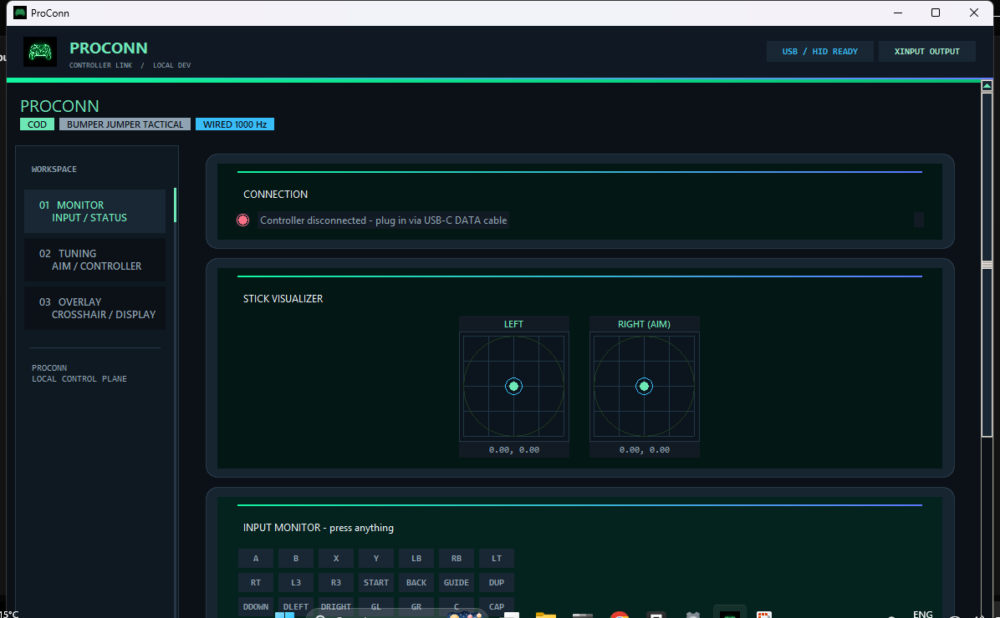

<p align="center">
  
</p>

<h1 align="center">ProConn</h1>

<p align="center">
  <strong>Use your Nintendo Switch 2 Pro Controller as a competitive Xbox pad on PC</strong>
</p>

<p align="center">
  <a href="https://github.com/tjcrims0nx/proconn/actions"></a>
  
  
  
  
</p>

<p align="center">
  
  
</p>

---

## ✨ What is this?

ProConn maps your **Nintendo Switch 2 Pro Controller** to a **virtual Xbox 360 gamepad** via [ViGEmBus](https://github.com/nefarius/ViGEmBus), giving you full compatibility with PC games that only support XInput — like Call of Duty and Destiny 2.

It's not just a remapper. It's a **full competitive tuning suite** inspired by Gamesir/SCUF/Cronus (but 100% legal — no injection, no memory editing, no game files touched).

### 🎮 Key Features

| Feature | Description |
|---------|-------------|
| **1000 Hz Wired Polling** | ~1ms input latency via USB-C, no Bluetooth stutter |
| **Aim-Assist Dial (0-100)** | One slider controls deadzone, sensitivity, curve & smoothing |
| **Dynamic Crosshair Overlay** | Movement-reactive bloom, screen-synced rendering, 7 styles |
| **Hair Triggers** | ZL/ZR tap = instant full press, configurable threshold |
| **Rear Paddle Mapping** | GL/GR/C/Capture → any Xbox button (R3, LB, etc.) |
| **ABXY Swap** | Nintendo ↔ Xbox layout swap (fixes in-game prompts) |
| **Response Curves** | Linear, Aggressive, Precise, Raw — per-game tuning |
| **ADS Damping** | Separate aim sensitivity while scoped |
| **Multi-controller support (beta)** | Switch 2 Pro HID plus DualShock, DualSense, and Xbox via SDL |
| **HID Direct Mode** | Bypasses SDL for Switch 2 Pro (057e:2069) detection |
| **Dark Neon GUI** | Enterprise-grade interface with live stick visualizer |
| **Auto-Reconnect** | Cable bumps? Reconnects in 1-2s, no restart needed |

---

## 📸 Screenshots

<p align="center">
  
</p>

<p align="center">
  <em>ProConn enterprise dashboard with Monitor, Tuning, and Overlay workspaces, live stick telemetry, and controller status.</em>
</p>

---

## 🚀 Quick Start

### Prerequisites

1. **Windows 10/11**
2. **Python 3.10+** — [python.org](https://www.python.org/downloads/)
3. **ViGEmBus driver** — [Download](https://github.com/nefarius/ViGEmBus/releases) (creates the virtual Xbox pad)
4. **USB-C DATA cable** (charge-only cables won't work — test with phone file transfer)

### Install

```bash
git clone https://github.com/tjcrims0nx/proconn.git
cd proconn
pip install -r requirements.txt
```

Or install as a package:

```bash
pip install -e .
```

### Wire Up Your Controller

1. Use a **USB-C data cable** → plug into a **rear motherboard USB port** (not hub/front panel)
2. Windows should play a connect sound
3. **Disable Bluetooth** on PC to prevent double-input
4. **Disable Steam Input** for your game (Steam → Settings → Controller)

### Run

```bash
# Launch with GUI (recommended)
python app.py --wired --gui

# Headless mode
python app.py --wired --profile cod_profile.json --aim 85

# Verify controller is detected
python app.py --wired --list

# Live calibration view
python app.py --wired --calibrate
```

### Or Download the EXE

Grab `ProConn.exe` or `ProConnSetup.exe` from [Releases](https://github.com/tjcrims0nx/proconn/releases) — no Python install needed.

---

## 🎯 Game Profiles

### Call of Duty (Warzone / MW3 / BO6)

```bash
python app.py --wired --gui --game cod
```

**Recommended COD settings:**
- Button Layout: **Bumper Jumper Tactical** (Jump=LB, Slide=R3)
- Stick Sensitivity: **6-6** or **7-7**, ADS **0.9x**
- Deadzone: Set to **0** in-game (let the mod handle it)
- Capture button → extra Crouch/Slide paddle

### Destiny 2

```bash
python app.py --wired --gui --game destiny2
```

---

## 🔫 Dynamic Crosshair System

The built-in crosshair overlay works like [Crossover](https://github.com/lacymorrow/crossover) but with pro features:

| Feature | Description |
|---------|-------------|
| **7 Styles** | Cross, Dot, Circle, Cross+Dot, T-Shape, Diamond, Chevron |
| **Movement Bloom** | Gap widens when sticks move, tightens when idle |
| **ADS Tighten** | Crosshair shrinks smoothly when aiming down sights |
| **Screen Sync** | Auto-detects monitor Hz for smooth rendering |
| **Color Shift** | Optional color change when moving |
| **Live Preview** | See your crosshair shape in the GUI before launching |

> **Note:** Requires **Windowed** or **Borderless Fullscreen** in-game. Exclusive fullscreen hides overlays.

---

## 🏗️ Architecture

```
app.py                    → Clean entrypoint
src/switch2mod/
├── cli.py                → CLI orchestration (argparse)
├── config.py             → AppConfig dataclass (single source of truth)
├── detection.py          → Controller detection (SDL + HID)
├── mapper.py             → SDL → XInput mapping service
├── hid_mapper.py         → Direct HID → XInput (057e:2069)
├── hid_reader.py         → Raw HID report parser
├── sticks.py             → Deadzone / curve / sensitivity pipeline
├── rear.py               → Rear paddle mapping (GL/GR/C/Capture)
├── crosshair.py          → Dynamic crosshair overlay system
├── gui.py                → Neon dark-themed Tk GUI
└── logging_setup.py      → Logging configuration
```

---

## 🔌 HID Direct Mode

The Switch 2 Pro Controller (vendor `057e`, product `2069`) is often hidden from SDL/pygame. HID mode bypasses SDL entirely:

```bash
# Test direct HID connection
python app.py --hid-calibrate

# Run in HID mode
python app.py --wired --hid --gui
```

If HID is silent, enable reports once via [procon2tool](https://handheldlegend.github.io/procon2tool/) (WebUSB), then retry. DualShock, DualSense, and Xbox controllers use SDL automatically; do not enable Switch 2 HID mode for them.

---

## 🛠️ Troubleshooting

| Problem | Solution |
|---------|----------|
| **No controller detected** | Use USB-C *data* cable → rear USB port. Try `--list` to diagnose |
| **Double input / drift** | Disable Steam Input, disable Bluetooth, use `--index` to pick wired pad |
| **COD doesn't see gamepad** | Install ViGEmBus, reboot, run mod *before* launching COD |
| **Input lag** | Rear USB port, close overlays (Discord/Chrome), 1000Hz polling, disable USB selective suspend |
| **Cable disconnects** | Just replug — auto-reconnects in 1-2s, no restart needed |
| **HID mode silent** | Enable via [procon2tool](https://handheldlegend.github.io/procon2tool/), fully exit Steam first |

---

## 📜 CLI Reference

```
python app.py [options]

Options:
  --gui                 Launch the GUI
  --wired               Force wired mode (1000Hz polling)
  --wireless            Force wireless mode
  --game {cod,destiny2} Game preset (default: cod)
  --profile FILE        Custom JSON profile
  --aim 0-100           Override aim-assist dial
  --hid                 Use direct HID reader (bypass SDL)
  --hid-calibrate       Live HID report dump
  --list                List detected controllers
  --calibrate           Interactive stick calibration
  --crosshair           Crosshair overlay only (no mapper)
  --index N             Select specific controller by index
  --no-center           Disable auto-center correction
  --log LEVEL           Log level (DEBUG/INFO/WARNING)
```

---

## 🤝 Contributing

1. Fork the repo
2. Create a feature branch (`git checkout -b feature/my-feature`)
3. Commit your changes (`git commit -m 'Add my feature'`)
4. Push to the branch (`git push origin feature/my-feature`)
5. Open a Pull Request

---

## ⚠️ Legal

This tool is **legal tuning only** — equivalent to a Gamesir/SCUF controller with custom deadzones and button remapping. It does not:
- Inject code into any game
- Modify game files or memory
- Provide aimbot or wallhacks
- Bypass anti-cheat

It creates a standard Xbox 360 virtual gamepad via ViGEmBus. Games see a normal controller.

---

<p align="center">
  <sub>Built with 💚 for competitive console-to-PC players</sub>
</p>
